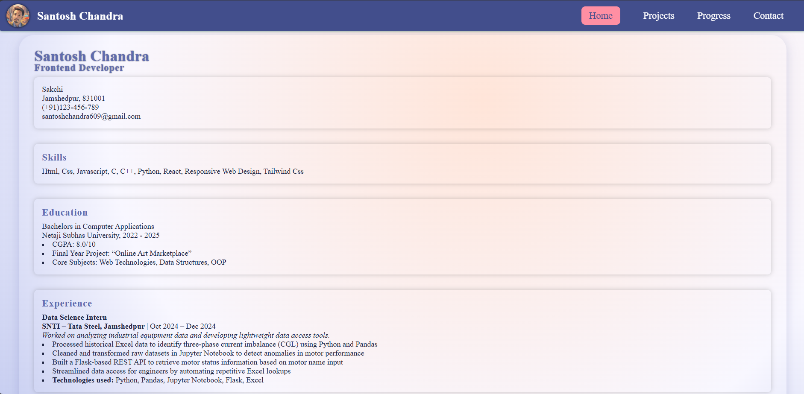

# 💼 Project 3: Personal Portfolio Website

This project is built as part of the official [roadmap.sh Portfolio Website Project](https://roadmap.sh/projects/portfolio-website).  
It is a responsive personal portfolio website using only **HTML and CSS**, focusing on layout, design, and responsiveness.

📁 [View Project Folder](https://github.com/SaNtOsH6099/Frontend-Projects-From-Roadmap.sh/tree/main/Project%203%20Personal%20portfolio)

---

## 🌐 Live Preview

> *(Optional)* Add this after deploying the site on GitHub Pages or any free host:
>
> [🔗 Live Site](https://SaNtOsH6099.github.io/Frontend-Projects-From-Roadmap.sh/Project%203%20Personal%20portfolio/)

---

## ✨ Features

- Responsive layout using Flexbox
- Navigation bar with active state
- About, Projects, and Contact sections
- Simple contact form structure
- Clean and minimal CSS styling
- Mobile-friendly design with media queries

---

## 🖼️ Demo Screenshot

---

## 📁 Folder Structure

